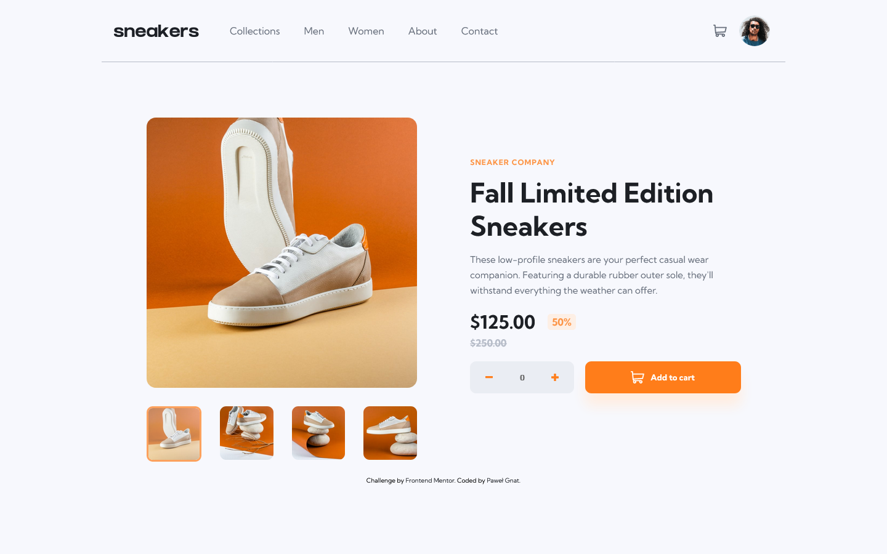

# Frontend Mentor - E-commerce product page solution

This is a solution to the [E-commerce product page challenge on Frontend Mentor](https://www.frontendmentor.io/challenges/ecommerce-product-page-UPsZ9MJp6). Frontend Mentor challenges help you improve your coding skills by building realistic projects.

## Table of contents

- [Overview](#overview)
  - [Screenshot](#screenshot)
  - [Links](#links)
- [My process](#my-process)
  - [Built with](#built-with)
  - [What I learned](#what-i-learned)
- [Author](#author)

## Overview

### Screenshot

### Links

- Live Site URL: [Frontend Mentor Ecommerce product page](https://pawel-gnat.github.io/Frontend-Mentor-Ecommerce-product-page/)

## My process

Not too much to say here about. I started with mobile view, coded my cart functions and carousel, then I switched to desktop view and finished necessary media queries and a modal.

### Built with

- Semantic HTML5 markup
- CSS custom properties
- Flexbox
- Mobile-first workflow
- JavaScript

### What I learned

It took me 26 hours to complete this task. I didn't code that modal as in design sheet. I found it redundant and unnecessary, because I've got a carousel in my mobile view.

## Author

- Frontend Mentor - [@Pawel-Gnat](https://www.frontendmentor.io/profile/Pawel-Gnat)
